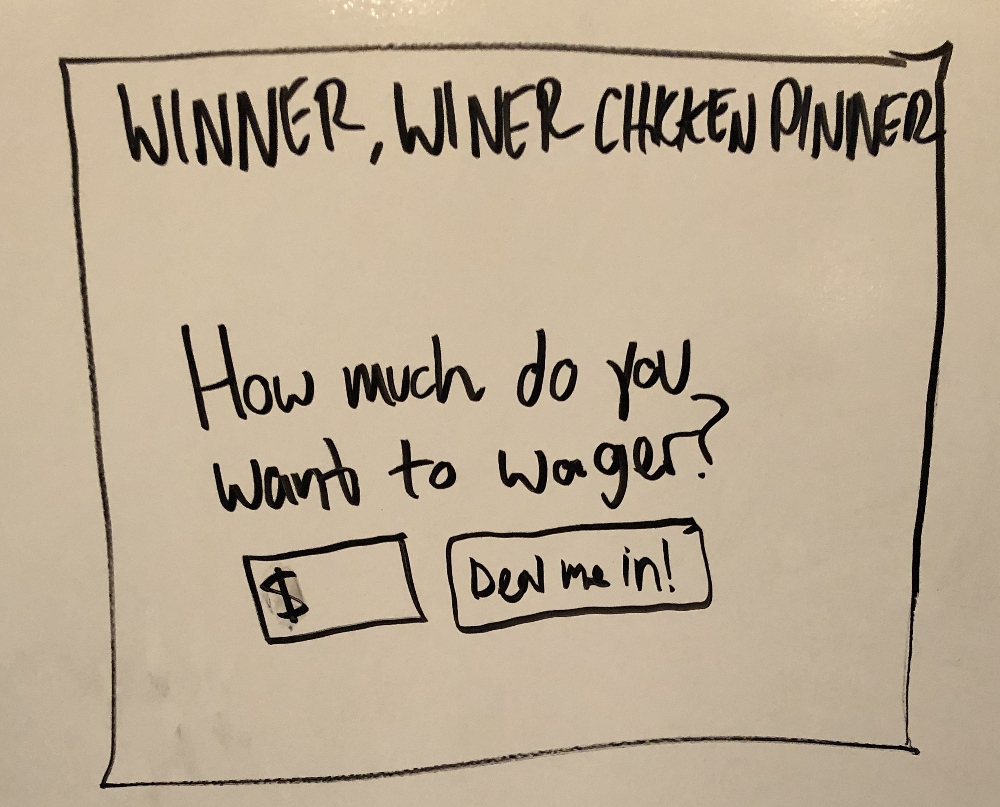
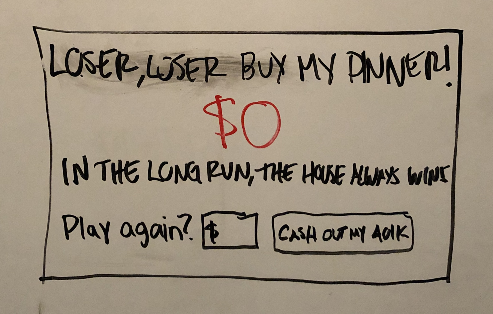
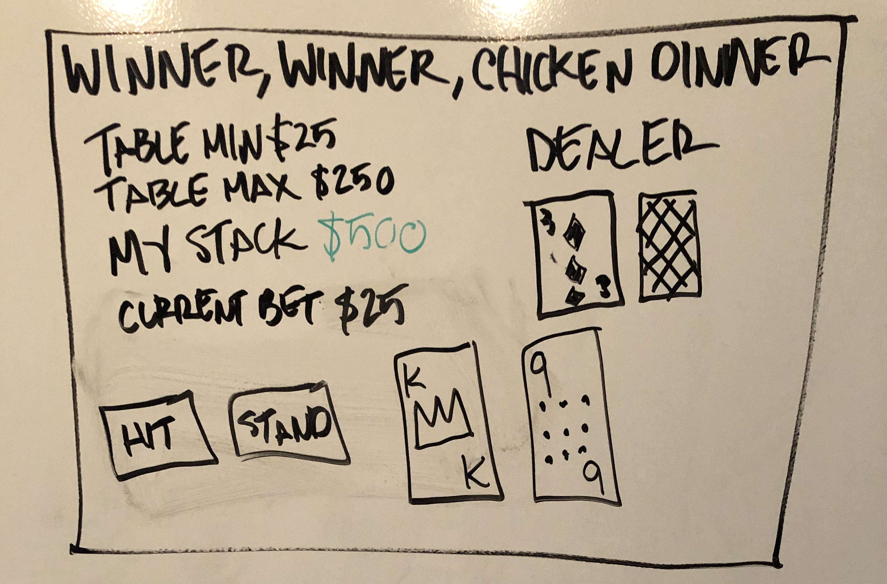
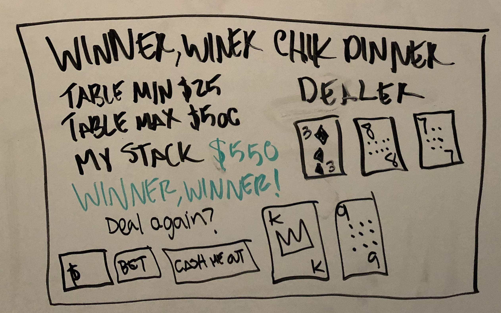

# Winner, winner, chicken dinner!

A JavaScript web app for playing Blackjack

## Overview

The goal of this project is to implement HTML, CSS and JS skills learned by creating a blackjack web app. The player can choose how much money to buy in for and then play against a dealer a succession of hands. If a player is smart he will choose to end the game while he is ahead and walk away with a profit and a chicken dinner. Alternately, a player will eventually find himself broke and the game will end with the player hungry.

## Name this section something later

[Trello board](https://trello.com/b/1CzxLqAz)

## Technology Used

Languages

- HTML 5
- CSS 3
- Java

Libraries

## Wireframe

## How to Play

1. The objective of the game is to beat the dealer. Each hand that is dealt you can win one of three ways:
   - be dealt a natural Blackjack which is an Ace plus any other face card or 10. An Ace (11 points) plus one of these other cards (face cards are all worth 10 points, numbered cards are worth their value) totals to 21.
   - Hit once or more and then stand at a higher score than the dealer without exceeding 21 points.
   - Stand and let the dealer hit, hoping they will exceed 21 points and go bust.
2. Each hand both you and the dealer will be dealt two cards. The dealer's first card, also known as a hole card, will be face up and visible to you.
3. Using the buttons on screen you can either hit or stand. If you chose to hit you will be dealt another card, you can contine to hit until you reach 21 points, chose to stand or exceed 21 points. Exceeding 21 points will lose the hand and your wager.
4. Once you stand it is the dealer's turn to play by also choosing to hit or stand.
5. A natural Blackjack pays out at a 3:2 ratio to the wager.
6. Any other win pays out at a 1:1 ratio to the wager.
7. Like with all gambling, the secret is knowing when- _and then chosing to_- walk away from the table. After each hand you are presented the choice of cashing out or continuing to play. Play long enough and you will eventually go broke.
